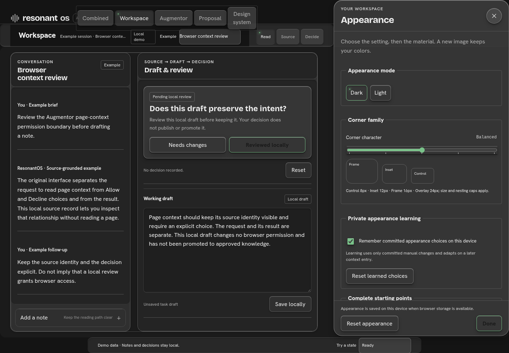

# Resonant Field

### A crafted, personal visual language for ROSI.

Resonant Field extends the ROSI design system within ResonantOS, putting people in control of how their workspace looks and feels. This is Simon's proposal for review and feedback.

[**Explore the interactive demo →**](https://simongonzalezdc.github.io/resonant-field/proposal/resonant-field-proposal.html#app) · [Read the design proposal](https://simongonzalezdc.github.io/resonant-field/proposal/resonant-field-proposal.html#proposal) · [Browse the component study](https://simongonzalezdc.github.io/resonant-field/proposal/resonant-field-proposal.html#design-system)

## See it in motion

| Possibilities | Appearance settings |
| --- | --- |
|  |  |
| A visual introduction to Resonant Field. | Explore the material and appearance controls. |

## Explore the system

- **A personal setting:** 24 selectable backgrounds, a plain field, independent material and accent hues, and light and dark appearances.
- **Materials with structure:** contextual depth, geometry, blending and finish support readable, ordinary HTML components.
- **A shared foundation:** matched ROSI specimens and an experimental Blackboard reference make the proposed adapter boundaries visible.
- **Local appearance choices:** the prototype demonstrates bounded preference learning with pause and reset controls.

The interactive prototype and [candidate runtime](runtime/materials/INTEGRATION.md) demonstrate the proposal. Integration across ResonantOS follows review and feedback; this repository does not claim a released extension, connected providers or upstream adoption. The reference comparisons retain their source styling and attribution.

## Review locally

No build or package installation is required. Clone or download this repository, serve its root with `python3 -m http.server --bind 127.0.0.1`, then open the server's root page. GitHub's file browser displays HTML as source; the live demo above opens the working interface.

When reporting an issue, identify the component, state, appearance and viewport. Screenshots help explain visual feedback. Appearance and depth never establish permission or approval.

## Attribution and reuse

Original proposal and candidate code are [review only](REVIEW-ONLY.md). Fonts and pinned reference code retain their own [third-party notices](THIRD_PARTY_NOTICES.md). Simon approved all included backgrounds; [asset provenance](ASSET-PROVENANCE.json) records the shipped bytes and their source lineage.
